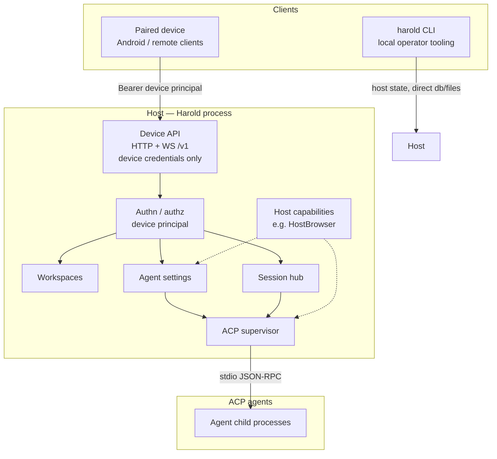
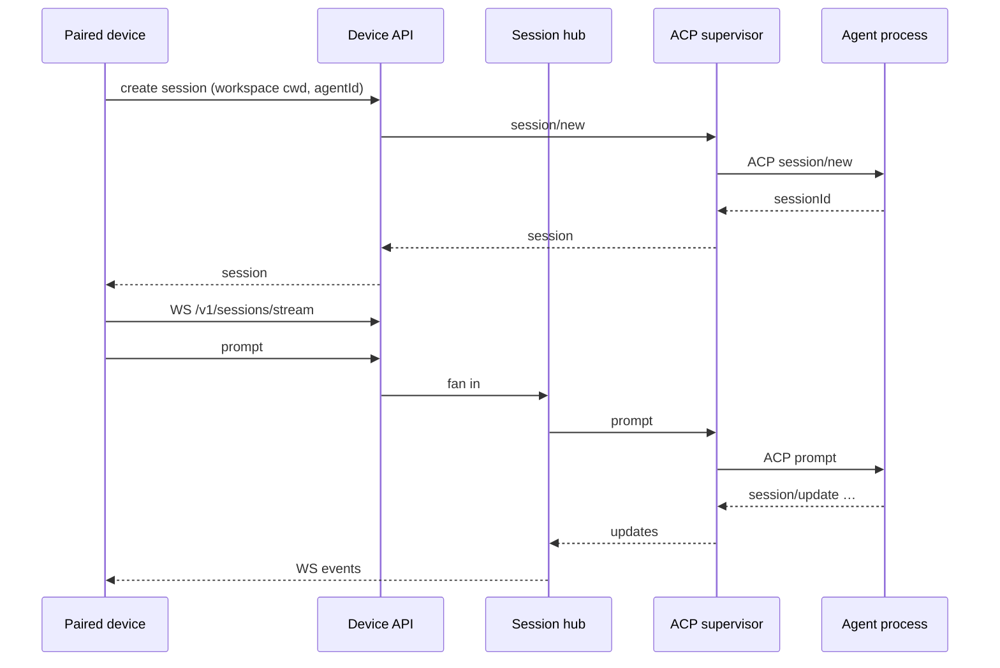
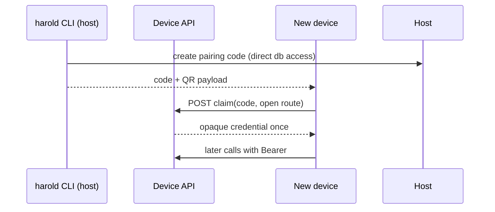

# Harold: terms and topology

Status: Draft  
Related: [ADR-0001 Device authentication](0001-device-authentication.md),
[ADR-0002 Device authorization](0002-device-authorization.md),
[ADR-0003 Device pairing](0003-device-pairing-protocol.md),
[ADR-0004 Agent auth broker](0004-agent-auth-broker.md),
[ADR-0007 Console retirement](0007-retire-console-device-only-edge.md),
[ADR-0005 Session stream frames](0005-session-stream-frames.md)

Harold is a local host process. It speaks HTTP and WebSocket to operator
clients. It speaks ACP to agent child processes. This ADR records the topology
and the naming boundaries for that split. The shared words live in
[CONTEXT.md](../../CONTEXT.md). Later ADRs decide auth, pairing, and agent
login. This one only names the map.

## Decision

1. Treat **Harold** as the product name for the host process and its
   device-facing API. One install. One host OS identity in v1.
2. Use [CONTEXT.md](../../CONTEXT.md) as the canonical glossary in docs,
   contracts, and UI copy. Prefer a qualified phrase when a bare word collides
   (for example **ACP agent capability** vs **host capability**).
3. Keep **devices off ACP**. Devices call the Device API only. The host is the
   ACP client. Agent processes are ACP servers. (The operator console that
   originally shared this band is retired per ADR-0007.)
4. Draw the topology as three bands: clients, host process, ACP agents. Do not
   draw provider login UI on devices as a direct ACP path
   ([ADR-0004](0004-agent-auth-broker.md)).

## Naming map

| Layer                  | Name                   |
| ---------------------- | ---------------------- |
| Product                | **Harold**             |
| Package                | `@codenamegary/harold` |
| CLI binary             | `harold`               |
| Runtime role           | **host**               |
| QR scheme              | `harold://pair?v=1`    |
| Data dir               | `~/.harold`            |
| Env prefix             | `HAROLD_*`             |
| Android application id | `harold.android`       |

## Glossary

The canonical glossary lives in [CONTEXT.md](../../CONTEXT.md). This ADR
keeps the topology and naming boundaries below.

## Topology

### How the bands interact

1. **Device → Device API.** Claims a pairing code once. Then uses Bearer on
   every call. The only operator surface over the network.
2. **CLI → host state.** The CLI runs on the host and reads the database,
   settings file, and daemon log directly. It never proxies operator actions
   over the Device API without a device credential.
3. **Device API → host modules.** Auth picks the principal. Routes hit
   workspaces, agent settings, session hub, devices.
4. **Host → agents.** Supervisor spawns enabled agents. Initializes with ACP
   client capabilities. Proxies session create, prompt, permissions, fs, and
   terminal against workspace roots.
5. **Host capabilities.** Optional host facilities (browser automation, and
   later others) sit beside the supervisor. Adapters or ACP handlers may use
   them. Clients still only see Device API shapes.

### Chat path (sketch)

### Pairing path (sketch)

## Boundaries we keep sharp

| Do                                                     | Do not                                               |
| ------------------------------------------------------ | ---------------------------------------------------- |
| Call the HTTP/WS surface the **Device API**            | Call it "the ACP API"                                |
| Say **host** for the process                           | Say "host principal"; HTTP has no host identity      |
| Say **device** for authenticated remote operators      | Say "console"; the web console is retired            |
| Qualify **capability** (ACP agent / ACP client / host) | Use bare "capability" for authz                      |
| Say **session** for ACP chat                           | Reuse "session" alone for device auth or agent login |

## Consequences

- New docs and UI strings should match [CONTEXT.md](../../CONTEXT.md). Rename
  drift when found.
- ADR-0001 through ADR-0004 stay the decision records for auth, pairing, and
  agent login. This ADR is the map they sit on.
- If a later milestone splits operator roles, update **Device** and **Device
  API** here before scattering new words through feature ADRs.

## Open questions for review

1. Is **Device API** the right product name, or should contracts say **Operator
   API** (now that devices are the only networked operator)?

## Amendment — console retired (ADR-0007)

The web operator console existed in the original topology as a loopback client
authenticated as a **host principal**. [ADR-0007](0007-retire-console-device-only-edge.md)
retires it: the HTTP edge is device-only by construction, the host principal no
longer exists, and the CLI is the local operator tooling. The diagrams above
reflect the amended topology.
