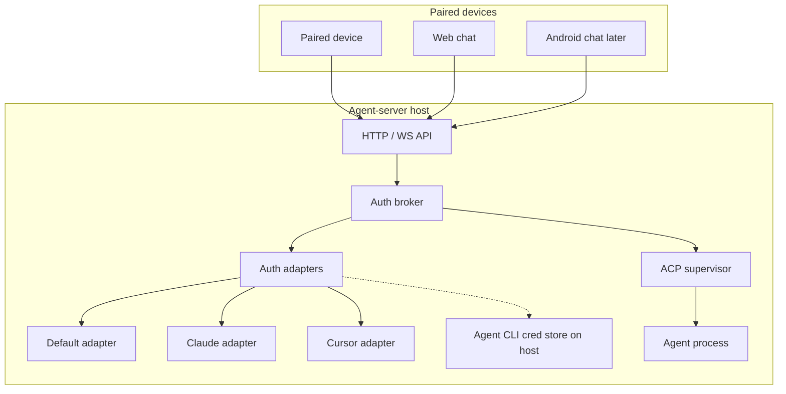
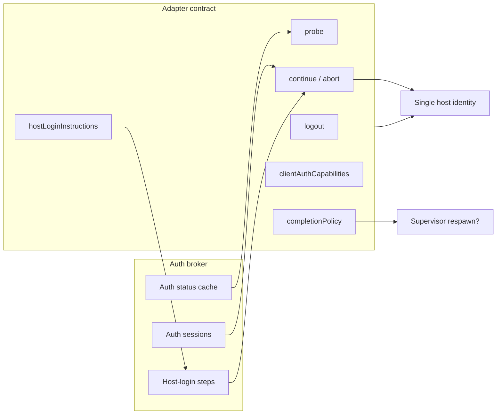
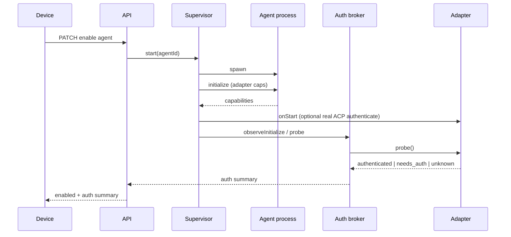
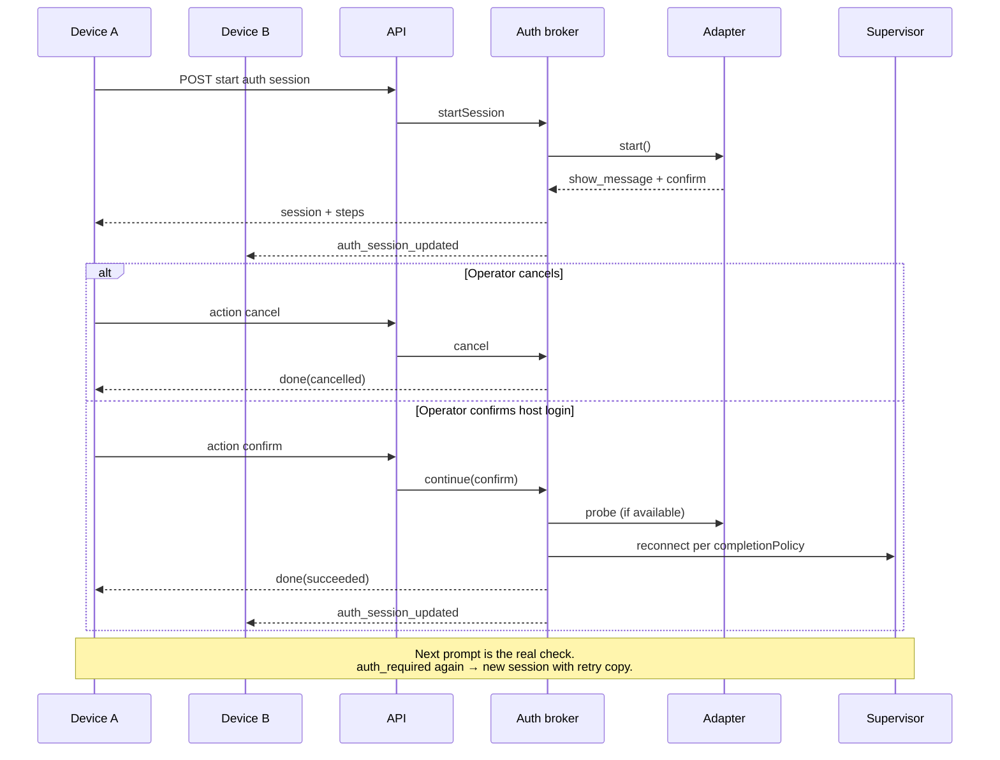
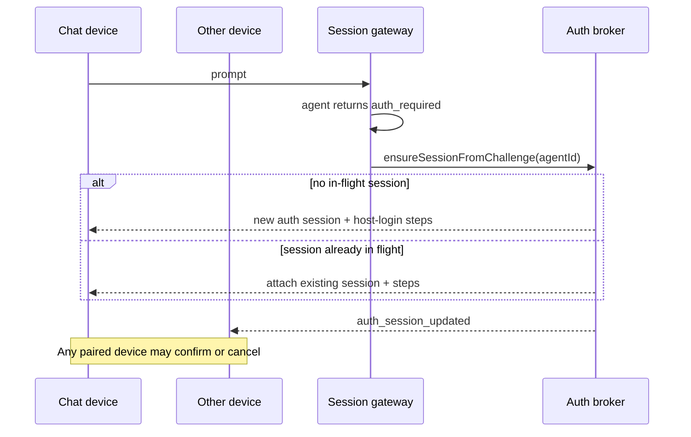
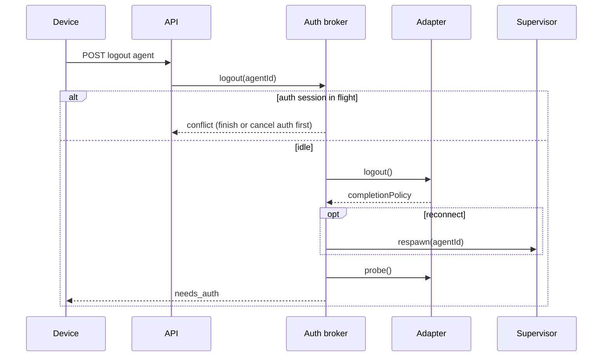
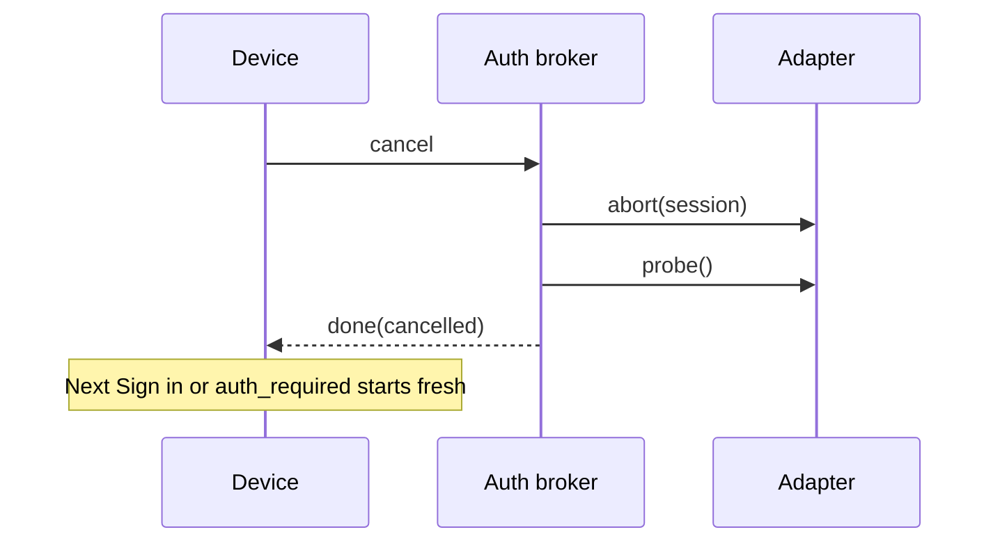

# Agent auth: host broker and host-login flow

Status: Accepted  
Related: [ADR-0001 Device authentication](0001-device-authentication.md), [ADR-0002 Device authorization](0002-device-authorization.md)

Agent auth (provider login for Claude, Cursor, and other ACP agents) is not
device auth. Agent-server is the ACP client and the host. Paired devices never
run provider login themselves. They drive a single **host-login** flow over our
HTTP/WS API: tell the operator what to run on the host, wait for confirmation,
reconnect, and verify on the next real prompt.

We do not call ACP `authenticate` with a catalog fantasy method id on start.
We do not collect API keys or other secrets in the broker. Credentials live in
each agent's normal host tooling (CLI files, env, keychain). The broker
orchestrates UX and probes when an adapter can.

## Decision

1. Treat **agent auth** as host-owned. Credentials live on the single host OS
   identity that runs agent processes. Devices may start Sign in, confirm host
   login, cancel, or Sign out. They do not hold provider secrets as the source
   of truth.
2. Put orchestration in an **Auth broker**. Put agent-specific copy and probe
   logic in **auth adapters**.
3. Ship **one Sign-in flow for every agent** in v1. No method picker. No secret
   paste. No in-app browser automation in v1.
   - `show_message` — adapter-specific instructions (always names the **host
     machine**; remote paired devices use the same copy).
   - `confirm` — **I have logged in** (operator finished on the host).
   - `working` — probe (if available) and reconnect per completion policy.
   - `done` — session finished for this attempt.
   - **Cancel** — end the auth session; agent stays unauthenticated until the
     next Sign in or gated prompt.
4. Use a **closed step vocabulary** on the wire: `show_message`, `confirm`,
   `working`, `done` only. Do not reserve future step types on the wire.
   Richer flows (method pickers, secret paste, URL open) need a later ADR
   before they appear in contracts.
5. Allow **one in-flight auth session per agent id**. Any paired device may view
   live steps, confirm, or cancel. Never echo secrets in steps or event payloads
   because v1 has no secret steps.
6. Keep **enable separate from auth**. An agent may be enabled and still
   `needs_auth`. Spawn and probe run on enable. Chat prompts stay gated until
   auth is good enough to proceed (see decision 9).
7. Do **not** advertise ACP `auth.terminal` globally. v1 does not proxy a
   provider terminal to devices. Adapters may still set other client auth caps
   on `initialize` when needed.
8. Remove blind catalog `authMethodId` **authenticate** from the supervisor
   start path. An adapter **`onStart`** may call ACP `authenticate` only for a
   real protocol method id the agent advertised — never the catalog default id.
9. **Verify auth pragmatically** after host login:
   - On **I have logged in**: adapter probe (if implemented), then honor
     **completion policy** (`reconnect` or `reuse_process`).
   - End the auth session after reconnect. Do not block the operator on probe
     `unknown`.
   - Allow prompts when summary is `authenticated` or `unknown`.
   - **Operational success** = the next gated prompt completes without
     `auth_required`. If a turn still returns `auth_required`, open a new auth
     session with retry copy ("That didn't work — sign in on the host and try
     again").
   - Probe `needs_auth` after confirm updates the summary but does not replace
     the reconnect + prompt check as the source of truth.
10. Probe through the adapter when possible (for example `claude auth status
--json`, or Cursor `cursor-agent status --format json`). Cache summary.
    Refresh after enable, logout, confirm, and on demand (Agents list loads
    probe **enabled** agents, with a short TTL).
11. **Logout** is `broker.logout(agentId)`. Any paired device may call it when
    the adapter supports it. Blocked while an auth session for that agent is in
    flight. Adapter clears host creds via the agent's normal CLI; broker stores
    nothing.
12. Start the same host-login session from **Agents Sign in** in settings and
    from mid-chat **`auth_required`** (create or attach the single in-flight
    session).
13. Ship a **default adapter** with generic host-login copy and probe
    `unknown`. Named adapters (Claude, Cursor, etc.) override instructions and
    probe/logout only. ACP `initialize` advertises auth methods for Cursor but
    does **not** report current login state. Host CLI status is the probe.
14. Surface auth **summary** on agent settings list responses. Full status and
    session live on `AgentAuth` from a dedicated auth endpoint.
15. **Defer** for a later ADR: HostBrowser / headless automation, API-key paste,
    method pickers, ACP terminal login in clients.

## Architecture

Agent-server is the host and the ACP client. Devices never speak ACP auth
directly.





## Critical flows

### Enable agent (auth separate)

No catalog `authenticate` on start. Probe sets auth summary. Agent may be
`ready` in the supervisor while summary is `needs_auth`.



### Sign in (host-login flow)

Same flow from settings **Sign in** or mid-chat **`auth_required`**.



### Mid-chat `auth_required` (create or attach)



### Logout



### Cancel mid-auth



## Type sketch (ideal shape)

Not shipped code. Target shapes for contracts (wire) and server slices.
Names may shift at implement time. No semicolons. Discriminated unions for
steps and actions.

### Target file structure

```text
packages/contracts/src/http/
  agent-auth.ts                 # wire: AgentAuth, summary, steps, actions
  agent-auth.test.ts

apps/server/src/agent/auth/
  routes.ts                     # GET/POST AgentAuth + session actions
  problems.ts
  broker.ts                     # AuthBroker + its types
  broker.test.ts
  session.ts                    # in-flight session state (one per agentId)
  status.ts                     # cached probe summaries
  registry.ts                   # resolve adapter by agentId
  supervisor.hooks.ts           # observeInitialize, ensureReadyForPrompt glue
  adapters/
    adapter.ts                  # AuthAdapter interface + adapter context types
    default.adapter.ts
    default.adapter.test.ts
    claude.adapter.ts           # Claude instructions + claude auth status probe
    claude.adapter.test.ts
    cursor.adapter.ts           # Cursor instructions + cursor-agent status probe
    cursor.adapter.test.ts

apps/android/.../agent/auth/
  # AgentAuth UI on the paired device (the web console client is retired
  # per ADR-0007; the server-side shapes are unchanged)
  auth.step.view.tsx            # render v1 step subset

apps/android/                   # later: same HTTP/WS contracts
```

Touch points outside the new slices (edit existing modules, do not invent a
parallel stack):

```text
apps/server/src/acp/supervisor/supervisor.ts
  # start: adapter caps + onStart; no catalog authenticate
apps/server/src/agent-settings/
  # embed AgentAuthSummary on list/get agent settings
apps/server/src/session/
  # auth_required → broker.ensureSessionFromChallenge
packages/contracts/src/http/agent-settings.ts
  # optional auth summary field on AgentSettings
```

### Wire: status, steps, actions

```ts
type AgentId = string

type AgentAuthStatus = "unknown" | "needs_auth" | "authenticated" | "error"

/** Badge fields on GET /v1/settings/agents items */
type AgentAuthSummary = {
  status: AgentAuthStatus
  error: string | null
  activeSessionId: string | null
  canLogout: boolean
}

type AuthSessionStatus = "in_progress" | "succeeded" | "failed" | "cancelled"

/** v1 product UX uses this subset only */
type AuthStepV1 =
  | {
      type: "show_message"
      level: "info" | "error"
      body: string
    }
  | {
      type: "confirm"
      stepId: string
      title: string
      body: string
      confirmLabel: string
    }
  | { type: "working"; label: string }
  | {
      type: "done"
      outcome: "succeeded" | "failed" | "cancelled"
      message: string | null
    }

type AuthStep = AuthStepV1

/** v1 actions */
type AuthSessionAction = { type: "confirm"; stepId: string } | { type: "cancel" }

type AgentAuthSession = {
  sessionId: string
  agentId: AgentId
  status: AuthSessionStatus
  steps: AuthStep[]
  error: string | null
}

/** GET /v1/agents/:agentId/auth */
type AgentAuth = {
  agentId: AgentId
  status: AgentAuthStatus
  error: string | null
  session: AgentAuthSession | null
}
```

### Adapter contract

```ts
type AuthCompletionPolicy = "reconnect" | "reuse_process"

type AdapterAuthContext = {
  agentId: AgentId
  hostIdentity: { id: "default" }
  /** Last initialize result, if the agent process is up */
  initializeResult: unknown | null
}

type AuthAdapter = {
  id: string
  matches: (agentId: AgentId) => boolean

  clientAuthCapabilities: (ctx: AdapterAuthContext) => Record<string, unknown>

  /** Shown in show_message; must name the host machine for remote devices */
  hostLoginInstructions: (ctx: AdapterAuthContext) => string

  probe: (ctx: AdapterAuthContext) => Promise<{
    status: AgentAuthStatus
    error: string | null
    canLogout: boolean
  }>

  /** Optional ACP authenticate after initialize; never catalog fantasy ids */
  onStart: (ctx: AdapterAuthContext) => Promise<void>

  completionPolicy: AuthCompletionPolicy

  /** Build initial host-login steps (message + confirm) */
  start: (
    ctx: AdapterAuthContext,
    input: { sessionId: string; retry: boolean },
  ) => Promise<{ steps: AuthStepV1[] }>

  /** Handle confirm: optional probe side effects; broker owns reconnect */
  continue: (
    ctx: AdapterAuthContext,
    input: {
      sessionId: string
      action: { type: "confirm"; stepId: string }
    },
  ) => Promise<{ steps: AuthStepV1[] }>

  abort: (ctx: AdapterAuthContext, input: { sessionId: string }) => Promise<void>

  logout: (ctx: AdapterAuthContext) => Promise<void>
}
```

Example Claude instructions (adapter-owned, not wire):

```text
Claude is not signed in on this host.

On the machine running Harold, open a terminal and run:
  claude auth login

When finished, tap I have logged in.
```

Retry sessions prepend: `That didn't work. Sign in on the host and try again.`

### Broker surface

```ts
type AuthBroker = {
  getSummary: (agentId: AgentId) => Promise<AgentAuthSummary>
  get: (agentId: AgentId) => Promise<AgentAuth>

  observeInitialize: (input: { agentId: AgentId; initializeResult: unknown }) => Promise<void>

  /** Block prompts only when probe says needs_auth; allow unknown */
  ensureReadyForPrompt: (
    agentId: AgentId,
  ) => Promise<
    { ok: true } | { ok: false; status: AgentAuthStatus; session: AgentAuthSession | null }
  >

  startSession: (input: { agentId: AgentId }) => Promise<AgentAuthSession>

  ensureSessionFromChallenge: (agentId: AgentId) => Promise<AgentAuthSession>

  applyAction: (input: {
    agentId: AgentId
    sessionId: string
    action: AuthSessionAction
  }) => Promise<AgentAuthSession>

  logout: (agentId: AgentId) => Promise<AgentAuthSummary>

  subscribe: (listener: (event: { agentId: AgentId; auth: AgentAuth }) => void) => () => void
}
```

### Supervisor seam

```ts
// start(agentId):
//   spawn → initialize(adapter.clientAuthCapabilities)
//   → adapter.onStart (optional real authenticate)
//   → broker.observeInitialize → adapter.probe
//   → mark ACP runtime ready even when auth summary is needs_auth
//   → never authenticate(catalog.authMethodId)

type SupervisorAuthHooks = {
  resolveAdapter: (agentId: AgentId) => AuthAdapter
  authBroker: AuthBroker
  requestRespawn: (agentId: AgentId) => Promise<void>
}
```

## Considered options

### Sign-in UX (v1)

| Option                                 | Verdict         | Why                                                                           |
| -------------------------------------- | --------------- | ----------------------------------------------------------------------------- |
| Single host-login flow for all agents  | **Selected**    | Matches how CLIs store creds. One client UX. Remote devices only orchestrate. |
| Per-agent method picker + secret paste | Rejected for v1 | Broker becomes a password manager. Duplicates provider UIs.                   |
| HostBrowser automation in v1           | Deferred        | High cost; host CLI login is enough for local operator installs.              |
| ACP terminal auth in clients           | Rejected        | Bad on phones. Wrong abstraction for our device API.                          |

### Auth vs enable

| Option                                | Verdict      | Why                                                                 |
| ------------------------------------- | ------------ | ------------------------------------------------------------------- |
| Enable and auth separate              | **Selected** | Host may already be logged in. Devices can Sign in later from chat. |
| Enable requires auth first            | Rejected     | Blocks spawn/probe. Couples settings to provider login.             |
| Blind catalog `authMethodId` on start | Rejected     | Broke Claude (`Method not implemented`).                            |

### Verify after host login

| Option                                                         | Verdict      | Why                                                         |
| -------------------------------------------------------------- | ------------ | ----------------------------------------------------------- |
| Reconnect + next prompt is the truth; retry on `auth_required` | **Selected** | Probe may be `unknown`. Operators still get a clear loop.   |
| Block until probe is `authenticated`                           | Rejected     | Many agents lack a probe CLI. False negatives strand users. |
| Optimistic `authenticated` on confirm only                     | Rejected     | Hides failures until unrelated errors surface.              |

### Concurrency

| Option                        | Verdict      | Why                                           |
| ----------------------------- | ------------ | --------------------------------------------- |
| One auth session per agent id | **Selected** | Host creds and login flows collide otherwise. |
| One auth session per device   | Rejected     | Two phones fighting one host login.           |

### Credentials

| Option                                   | Verdict             | Why                           |
| ---------------------------------------- | ------------------- | ----------------------------- |
| Single host OS identity                  | **Selected for v1** | Matches one operator install. |
| Broker / SQLite as provider secret store | Rejected            | Host CLI is the vault.        |
| API key paste in broker                  | Rejected for v1     | Defer to host env / CLI.      |

## Consequences

- Supervisor start must stop calling `authenticate` with catalog ids. A stub
  broker can land first and still fix Claude enable failures.
- Agent settings and chat need Sign in, cancel, and Sign out entry points on
  web and Android (AGE-74) reuse the same host-login contracts.
- Auth adapters are mostly **copy + probe + logout**, not login wizards.
- Claude adapter v1: `claude auth login` instructions and `claude auth status`
  probe; creds stay in Claude's host store.
- Default adapter: generic instructions, probe `unknown`, logout no-op.
- Paired devices are full operators for agent auth ([ADR-0002](0002-device-authorization.md)).
  Revisit if least-privilege device roles appear later.
- HostBrowser, method pickers, and secret steps need a new ADR before build.

## Sources

- [ACP v1 Authentication][acp-auth]
- [Claude Code authentication][claude-auth]
- Grill session (2026-08-22): host broker, enable ≠ auth, single host-login
  flow, defer browser and secret collection, pragmatic verify on next prompt
- Define session (2026-08-22): trim scope; agent-specific messaging only;
  Settings + mid-chat entry; cancel ends session

[acp-auth]: https://agentclientprotocol.com/protocol/v1/authentication
[claude-auth]: https://code.claude.com/docs/en/authentication
