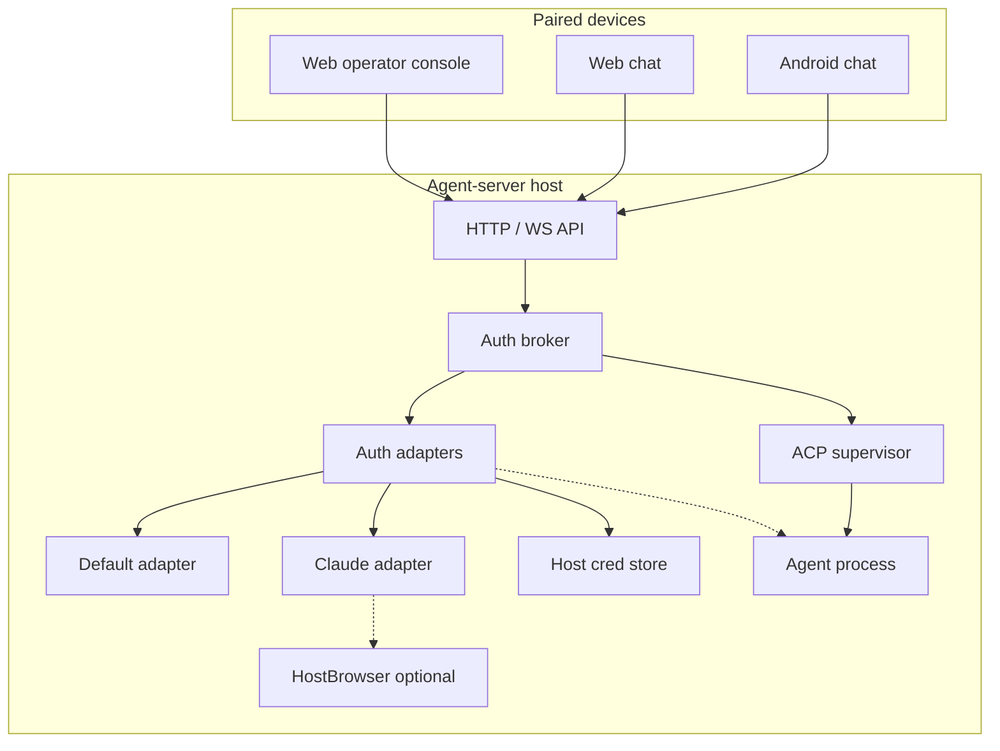
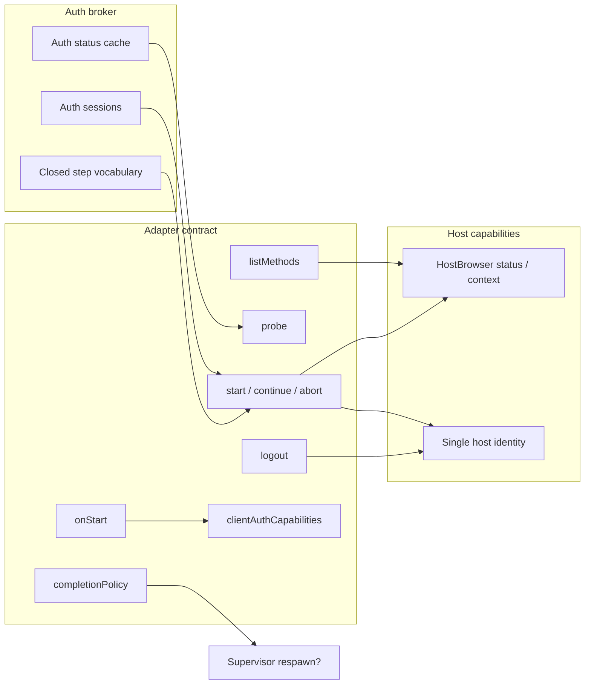
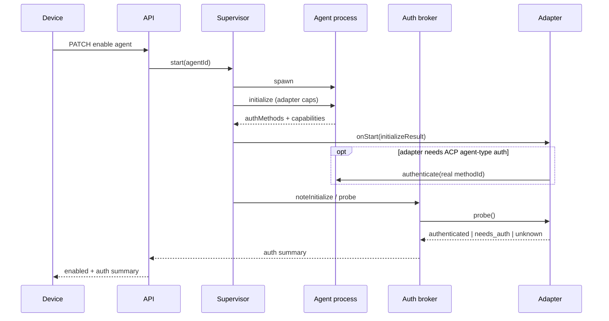
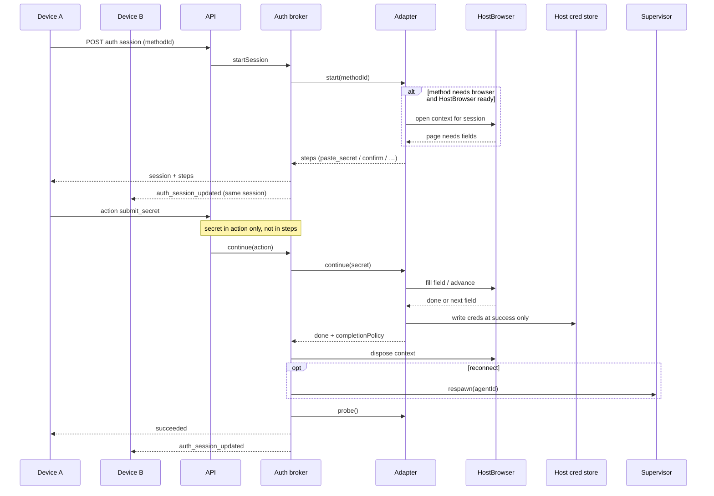
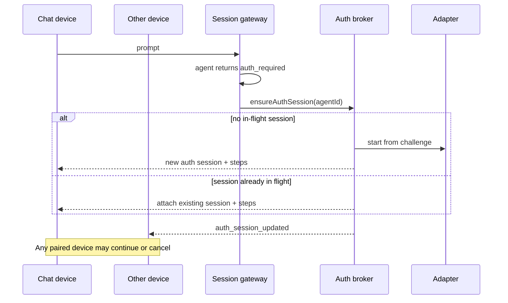
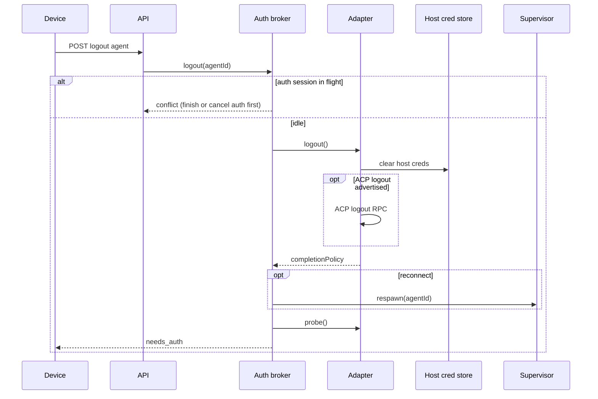
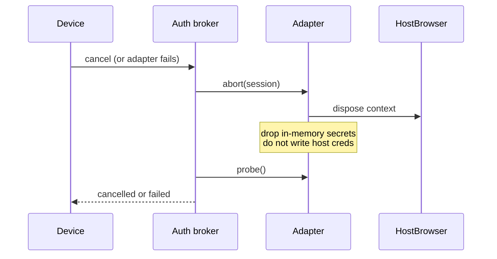

# Agent auth: host broker, adapters, optional headless browser

Status: Accepted  
Related: [ADR-0001 Device authentication](0001-device-authentication.md), [ADR-0002 Device authorization](0002-device-authorization.md)

Agent auth (provider login for Claude, Cursor, and other ACP agents) is not
device auth. Agent-server is the ACP client and the host. Paired devices only
drive structured auth steps over our HTTP/WS API. We do not show a terminal UI.
We do not call ACP `authenticate` with a catalog fantasy method id on every
start. An Auth broker orchestrates. Per-agent adapters decide methods and ACP
capabilities. Optional HostBrowser is a host capability adapters may use later.

## Decision

1. Treat **agent auth** as host-owned. Credentials live on the single host OS
   identity that runs agent processes. Devices trigger login/logout. They do not
   hold provider secrets as the source of truth.
2. Put orchestration in an **Auth broker**. Put agent quirks in **auth adapters**.
   Put optional automation browser in a **HostBrowser** host capability.
3. Expose a device API of **auth sessions** and a **closed step vocabulary**
   (`choose_method`, `open_url`, `paste_secret`, `confirm`, `show_message`,
   `working`, `done`). Design steps so a richer form schema can arrive later
   without rewriting the broker.
4. Allow **one in-flight auth session per agent id**. Any paired device may view
   live steps and cancel. Secrets travel only in submit actions. Never echo
   secrets in steps or event payloads.
5. Keep **enable separate from auth**. An agent may be enabled and still
   `needs_auth`. Sessions and prompts that need provider auth stay gated until
   the adapter probe says authenticated (or an `auth_required` challenge starts
   or attaches the single-flight session).
6. Build the Sign-in method list from **`adapter.listMethods(ctx)`**. ACP
   `initialize.authMethods` are adapter input, not the UI list. Browser-dependent
   methods stay visible but disabled when HostBrowser is missing.
7. Let each adapter choose ACP **client auth capabilities** on `initialize`.
   Do not globally advertise `auth.terminal` only because a browser exists.
   HostBrowser filling pages is not the same contract as ACP terminal login.
8. Remove blind catalog `authMethodId` authenticate from the supervisor start
   path. An adapter **`onStart`** may call ACP `authenticate` when the agent
   truly needs a protocol-driven agent-type method.
9. After auth success, honor the adapter **completion policy** (`reconnect` or
   `reuse_process`). On cancel or failure, abort the adapter work, dispose any
   browser context for that session, clear in-memory secrets, and do not run a
   host-cred snapshot rollback. Write host credentials only at the success
   boundary.
10. Probe auth status through the adapter (for example `claude auth status`).
    Cache. Refresh after login, logout, and on demand.
11. **Logout** is `broker.logout(agentId)`. Any paired device may call it.
    Blocked while an auth session for that agent is in flight.
12. On mid-turn **`auth_required`**, create a single-flight auth session or
    attach clients to the existing one.
13. Ship a **default adapter** that maps ACP agent-type methods best-effort,
    leaves terminal methods disabled until a translator exists, and probes as
    `unknown` when it cannot know. Custom adapters (Claude first) override.
14. Put HostBrowser **install/status** in Host settings, not under Agents auth.
    Auth methods may point at that status. One browser context per auth session
    when used. No host-wide browser queue in v1.
15. Surface auth **summary** on agent settings list responses. Full status,
    methods, and session live on `AgentAuth` from a dedicated auth endpoint.

## Architecture

Agent-server is the host and the ACP client. Devices never speak ACP auth
directly.





## Critical flows

### Enable agent (auth separate)

No catalog `authenticate` on start. Adapter may run a real ACP `authenticate`
only when `onStart` says so. Probe sets auth summary.



### Sign in (structured steps, optional HostBrowser)

One session per agent. Secrets only in actions. Browser stays on the host.



### Mid-chat `auth_required` (create or attach)



### Logout



### Cancel or fail mid-auth



## Type sketch (ideal shape)

Not shipped code. Target shapes for contracts (wire) and server slices.
Names may shift at implement time. No semicolons. Discriminated unions for
steps and actions.

### Target file structure

Vertical slices as nested directories. Dot-separated filenames inside each
slice. No `models.ts` dumping ground. No barrel `index.ts` re-exports. Types
live and export from the module that owns them (for example `AuthAdapter` from
`adapter.ts`, session state types from `session.ts`).

```text
packages/contracts/src/http/
  agent-auth.ts                 # wire: AgentAuth, summary, steps, actions
  agent-auth.test.ts

apps/server/src/agent/auth/
  routes.ts                     # GET/POST AgentAuth + session actions
  problems.ts
  broker.ts                     # AuthBroker + its types
  broker.test.ts
  session.ts                    # in-flight session state (one per agentId)
  status.ts                     # cached probe summaries
  registry.ts                   # resolve adapter by agentId
  supervisor.hooks.ts           # observeInitialize, ensureReadyForPrompt glue
  adapters/
    adapter.ts                  # AuthAdapter interface + adapter context types
    default.adapter.ts          # ACP best-effort mapping
    default.adapter.test.ts
    claude.adapter.ts           # Claude host-cred / browser flows
    claude.adapter.test.ts

apps/server/src/browser/
  routes.ts                     # operator Host settings: status / install
  problems.ts
  service.ts                    # HostBrowser capability + context types
  service.test.ts
  stub.ts                       # v1: always missing until real install lands

apps/web/src/agent/auth/
  agent.auth.ts                 # fetch helpers for AgentAuth
  auth.session.actions.ts
  use.agent.auth.ts             # react-query hooks
  AgentAuthPanel.tsx            # console Sign in / steps UI
  AgentAuthBadge.tsx
  auth.step.view.tsx            # render closed step vocabulary

apps/web/src/browser/
  HostBrowserSettings.tsx       # install / status in Host settings
  use.host.browser.ts
```

Android chat later consumes the same HTTP/WS contracts. No separate auth
protocol.

Touch points outside the new slices (edit existing modules, do not invent a
parallel stack):

```text
apps/server/src/acp/supervisor/supervisor.ts
  # start: adapter caps + onStart; no catalog authenticate
apps/server/src/agent-settings/
  # embed AgentAuthSummary on list/get agent settings
apps/server/src/session/
  # auth_required → broker.ensureSessionFromChallenge
packages/contracts/src/http/agent-settings.ts
  # optional auth summary field on AgentSettings
```

### Wire: status, methods, steps, actions

```ts
type AgentId = string

type AgentAuthStatus =
  | "unknown"
  | "needs_auth"
  | "authenticated"
  | "error"

/** Badge fields on GET /v1/settings/agents items */
type AgentAuthSummary = {
  status: AgentAuthStatus
  error: string | null
  activeSessionId: string | null
  canLogout: boolean
}

type AgentAuthMethodAvailability =
  | { kind: "available" }
  | {
      kind: "disabled"
      reason: string
      /** e.g. open Host settings for headless browser */
      remediation: "host_browser" | "none"
    }

type AgentAuthMethod = {
  methodId: string
  title: string
  description: string
  availability: AgentAuthMethodAvailability
}

type AuthSessionStatus =
  | "in_progress"
  | "succeeded"
  | "failed"
  | "cancelled"

type AuthStep =
  | {
      type: "choose_method"
      methods: AgentAuthMethod[]
    }
  | {
      type: "open_url"
      title: string
      url: string
      caption: string | null
    }
  | {
      type: "paste_secret"
      stepId: string
      label: string
      placeholder: string | null
      secretKind: "api_key" | "oauth_token" | "otp" | "other"
    }
  | {
      type: "confirm"
      stepId: string
      title: string
      body: string
      confirmLabel: string
    }
  | {
      type: "show_message"
      level: "info" | "error"
      body: string
    }
  | { type: "working"; label: string }
  | {
      type: "done"
      outcome: "succeeded" | "failed" | "cancelled"
      message: string | null
    }

/** Secrets only appear here, never on AuthStep or WS payloads */
type AuthSessionAction =
  | { type: "select_method"; methodId: string }
  | {
      type: "submit_secret"
      stepId: string
      value: string
    }
  | { type: "confirm"; stepId: string }
  | { type: "ack_open_url"; stepId?: string }
  | { type: "cancel" }

type AgentAuthSession = {
  sessionId: string
  agentId: AgentId
  status: AuthSessionStatus
  methodId: string | null
  steps: AuthStep[]
  error: string | null
}

/** GET /v1/agents/:agentId/auth (same noun style as AgentSettings, Workspace) */
type AgentAuth = {
  agentId: AgentId
  status: AgentAuthStatus
  error: string | null
  methods: AgentAuthMethod[]
  session: AgentAuthSession | null
  hostBrowser: HostBrowserStatus
}
```

### HostBrowser capability

```ts
type HostBrowserStatus =
  | { state: "missing" }
  | { state: "installing" }
  | { state: "ready" }
  | { state: "error"; message: string }

type HostBrowser = {
  status: () => HostBrowserStatus
  /** One context per auth session when an adapter needs automation */
  openContext: (input: {
    ownerSessionId: string
  }) => Promise<HostBrowserContext>
}

type HostBrowserContext = {
  ownerSessionId: string
  navigate: (url: string) => Promise<void>
  /** Adapter-defined; library TBD */
  readNeededInputs: () => Promise<BrowserNeededInput[]>
  fill: (input: {
    fieldId: string
    value: string
  }) => Promise<void>
  dispose: () => Promise<void>
}

type BrowserNeededInput = {
  fieldId: string
  label: string
  secretKind: "api_key" | "oauth_token" | "otp" | "other"
}
```

### Adapter contract

```ts
type AuthCompletionPolicy = "reconnect" | "reuse_process"

type AdapterAuthContext = {
  agentId: AgentId
  hostIdentity: { id: "default" }
  hostBrowser: HostBrowser
  /** Last initialize result, if the agent process is up */
  initializeResult: unknown | null
}

type AuthAdapter = {
  id: string
  /** Which catalog / custom agent ids this adapter owns */
  matches: (agentId: AgentId) => boolean

  clientAuthCapabilities: (
    ctx: AdapterAuthContext,
  ) => Record<string, unknown>

  listMethods: (
    ctx: AdapterAuthContext,
  ) => Promise<AgentAuthMethod[]>

  probe: (ctx: AdapterAuthContext) => Promise<{
    status: AgentAuthStatus
    error: string | null
    canLogout: boolean
  }>

  /** Optional ACP authenticate after initialize; never catalog fantasy ids */
  onStart: (ctx: AdapterAuthContext) => Promise<void>

  start: (
    ctx: AdapterAuthContext,
    input: {
      sessionId: string
      methodId: string | null
      fromChallenge: boolean
    },
  ) => Promise<{ steps: AuthStep[] }>

  continue: (
    ctx: AdapterAuthContext,
    input: {
      sessionId: string
      action: Exclude<AuthSessionAction, { type: "cancel" }>
    },
  ) => Promise<{
    steps: AuthStep[]
    finished: null | {
      outcome: "succeeded" | "failed"
      completionPolicy: AuthCompletionPolicy
      error: string | null
    }
  }>

  abort: (
    ctx: AdapterAuthContext,
    input: { sessionId: string },
  ) => Promise<void>

  logout: (
    ctx: AdapterAuthContext,
  ) => Promise<{ completionPolicy: AuthCompletionPolicy }>
}
```

### Broker surface

```ts
type AuthBroker = {
  getSummary: (agentId: AgentId) => Promise<AgentAuthSummary>
  get: (agentId: AgentId) => Promise<AgentAuth>

  /** Supervisor calls after initialize (and after respawn) */
  observeInitialize: (input: {
    agentId: AgentId
    initializeResult: unknown
  }) => Promise<void>

  ensureReadyForPrompt: (
    agentId: AgentId,
  ) => Promise<
    | { ok: true }
    | { ok: false; status: AgentAuthStatus }
  >

  startSession: (input: {
    agentId: AgentId
    methodId?: string
  }) => Promise<AgentAuthSession>

  /** auth_required: create or return the single in-flight session */
  ensureSessionFromChallenge: (
    agentId: AgentId,
  ) => Promise<AgentAuthSession>

  applyAction: (input: {
    agentId: AgentId
    sessionId: string
    action: AuthSessionAction
  }) => Promise<AgentAuthSession>

  logout: (agentId: AgentId) => Promise<AgentAuthSummary>

  /** Fan-out to paired devices */
  subscribe: (
    listener: (event: {
      agentId: AgentId
      auth: AgentAuth
    }) => void,
  ) => () => void
}
```

### Supervisor seam

```ts
// start(agentId):
//   spawn → initialize(adapter.clientAuthCapabilities)
//   → adapter.onStart (optional real authenticate)
//   → broker.observeInitialize → adapter.probe
//   → mark ACP runtime ready even when auth summary is needs_auth
//   → never authenticate(catalog.authMethodId)

type SupervisorAuthHooks = {
  resolveAdapter: (agentId: AgentId) => AuthAdapter
  authBroker: AuthBroker
  requestRespawn: (agentId: AgentId) => Promise<void>
}
```

## Considered options

### Architecture shape

| Option | Verdict | Why |
|--------|---------|-----|
| Host capability + broker + adapters | **Selected** | Browser reusable. Broker stays UX/session. Adapters own agent differences. |
| Browser only inside Claude adapter | Rejected | Locks a host facility into one agent. Harder status/install UX. |
| Broker owns browser sessions directly | Rejected | Mixes orchestration with automation. Harder to stub and reuse. |

### Device UX for login

| Option | Verdict | Why |
|--------|---------|-----|
| Closed step vocabulary (v1) | **Selected** | One UX for web console, web chat, Android. |
| Raw PTY / terminal view in clients | Rejected | Bad remote UX. Wrong for phones. Host should translate. |
| Adapter-defined freeform UI schema now | Deferred | Future target. Keep step model extensible. |

### Auth vs enable

| Option | Verdict | Why |
|--------|---------|-----|
| Enable and auth separate | **Selected** | Host may already be logged in. Devices can Sign in later from chat. |
| Enable requires auth first | Rejected | Blocks spawn/probe. Couples settings to provider login. |
| Enable always opens auth | Rejected | Noisy when host creds already work. |

### Method list source

| Option | Verdict | Why |
|--------|---------|-----|
| Adapter-declared methods | **Selected** | Claude often returns empty ACP `authMethods` unless we advertise terminal. Product still needs Sign in. |
| Raw ACP `authMethods` only | Rejected | Empty list hides real host login paths. |
| Blind catalog `authMethodId` on start | Rejected | Broke Claude (`Method not implemented`). |

### Concurrency

| Option | Verdict | Why |
|--------|---------|-----|
| One auth session per agent id | **Selected** | Host creds and login flows collide otherwise. |
| One auth session per device | Rejected | Two phones fighting one Claude login. |
| Host-wide browser lock/queue | Rejected for v1 | Extra complexity. Common case is one device. Browser context follows the auth session. |

### Credentials

| Option | Verdict | Why |
|--------|---------|-----|
| Single host OS identity | **Selected for v1** | Matches one operator install. |
| Per-agent isolated cred namespaces | Deferred | Pass a host-identity handle into adapters so this can land later. |
| Store long-lived provider tokens in app DB as source of truth | Rejected | Host is the vault. Broker is not a password manager. |

## Consequences

- Supervisor start must stop calling `authenticate` with catalog ids. Slice 0
  can stub the broker and still fix Claude spawn failure mode.
- Agent settings wire grows an auth summary. Clients need Sign in / Sign out
  entry points on console and later chat.
- Host settings gains headless browser status/install even if the first browser
  implementation is a `missing` stub.
- Claude support likely uses HostBrowser and/or host token install inside a
  Claude adapter, not a client terminal and not a fake `claude-acp` method id.
- Default adapter gives unknown ACP agents a minimal Sign in path when they
  expose agent-type methods. Terminal-only agents need a dedicated adapter or
  stay disabled-with-reason until one exists.
- Paired devices are full operators for agent auth ([ADR-0002](0002-device-authorization.md)).
  Revisit if least-privilege device roles appear later.

## Sources

- [ACP v1 Authentication][acp-auth]
- [ACP Terminal Authentication RFD][acp-terminal-auth]
- [Claude Code authentication][claude-auth]
- Grill session decisions (2026-08-22): host broker Option E, closed steps,
  HostBrowser as optional host capability, enable ≠ auth

[acp-auth]: https://agentclientprotocol.com/protocol/v1/authentication
[acp-terminal-auth]: https://agentclientprotocol.com/rfds/auth-methods
[claude-auth]: https://code.claude.com/docs/en/authentication
